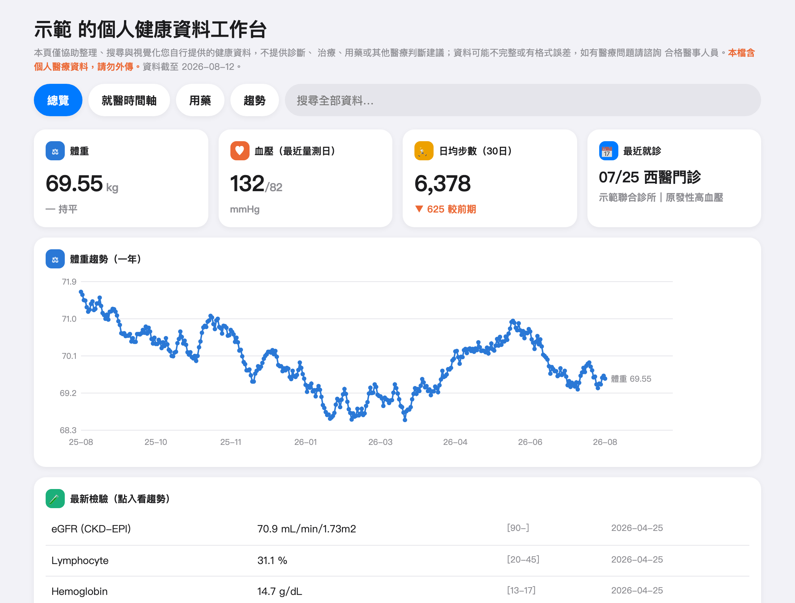
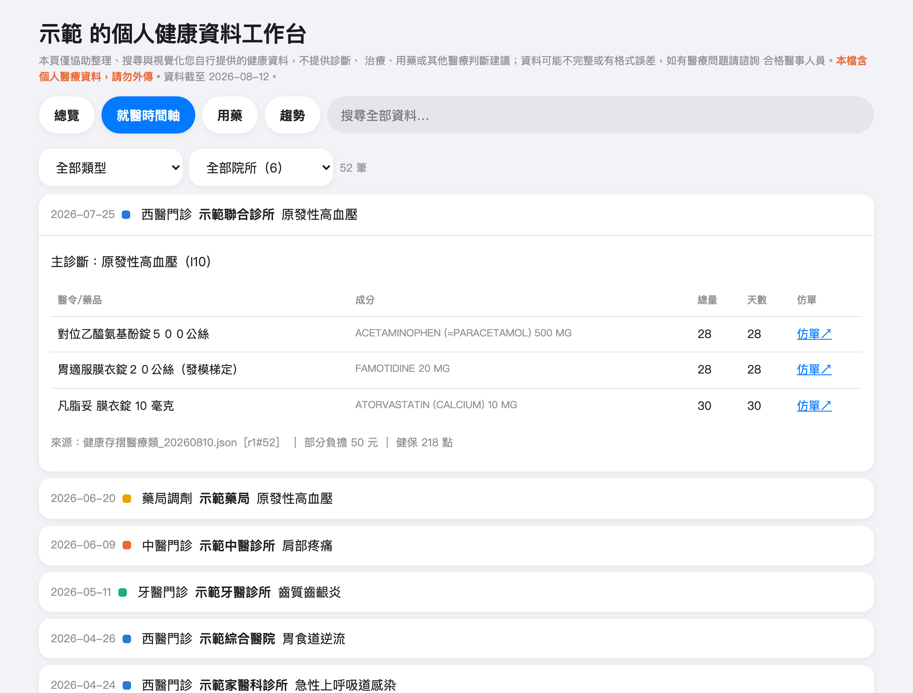
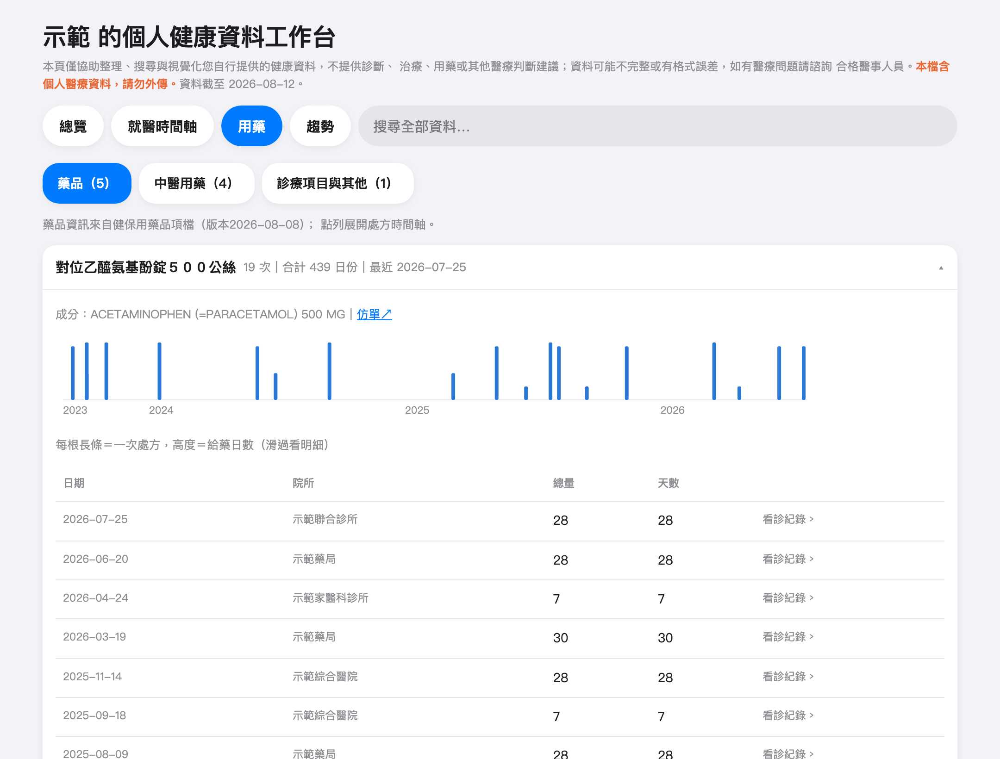
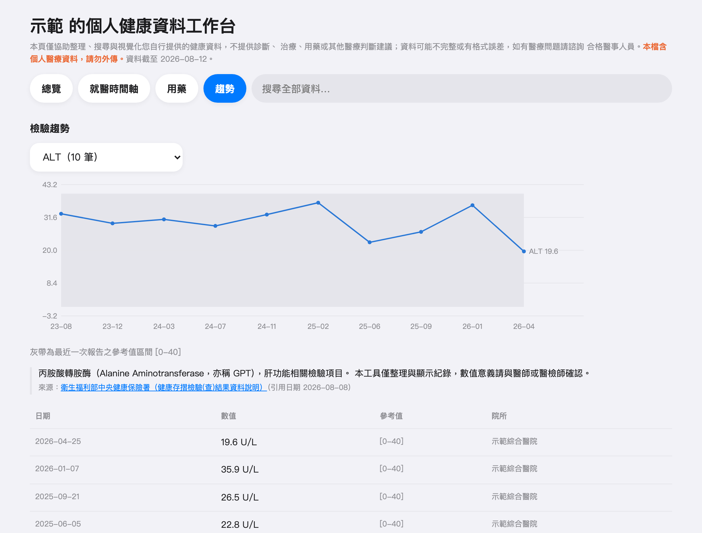

<div align="center">

# HealthWorkbench：個人健康資料工作台

[](https://github.com/notoriouslab/health-workbench/releases)
[](https://github.com/notoriouslab/health-workbench/releases)
[](LICENSE)
[](https://github.com/notoriouslab/health-workbench/releases)
[](https://tauri.app/)
[]()
[](https://github.com/notoriouslab/health-workbench/commits)

**把健保「健康存摺」、Apple 健康與 CPAP 呼吸器的下載檔，變成一份越養越深、
可搜尋、可帶去回診討論的家庭健康紀錄。全程本機，資料不離開你的電腦。**

macOS／Windows 桌面 App · 不需要帳號 · 檢視時不需要網路

### [⬇️ 前往下載](https://github.com/notoriouslab/health-workbench/releases/latest)

（macOS 選 `.dmg`；Windows 選 `.msi` 或 `.exe`。安裝與首次開啟說明見下方
[安裝](#安裝)）

屬於 [notoriouslab](https://github.com/notoriouslab) 開源工具組的一員

</div>

---

> ### 免責聲明
> **本軟體僅進行個人健康資料的備份、匯整、搜尋與視覺化排版，不提供任何
> 醫療診斷、治療、用藥或其他醫療判斷建議。** 資料可能不完整或有格式誤差，
> 畫面上數值的意義請諮詢合格醫事人員。軟體全程本機運作，匯出的檔案含有
> 完整個人醫療資料，請妥善保管，切勿隨意外傳。

## 這是什麼？

健保署的「健康存摺」只查得到最近三年的就醫與用藥紀錄，Apple 健康的
匯出檔又大又難讀，CPAP 呼吸器的資料則鎖在一張 SD 卡裡。HealthWorkbench
把這些來源整理進同一個本機資料庫：每隔一陣子把新下載的檔案拖進來，
三年的滾動視窗就被接成不斷加深的個人縱深，重複的部分自動跳過，
不會越匯越亂。

打開 App 就是完整的健康儀表板：總覽、就醫時間軸、用藥清單（附成分
與官方仿單連結）、檢驗趨勢、睡眠呼吸，還有全文搜尋。要給家人或帶去
診間，可以匯出成單一 HTML 檔或 EPUB 電子書，兩種都是獨立檔案，
收到的人不必安裝這個 App，摺疊、搜尋與趨勢圖照樣能互動。

## 核心特色

- **資料留在自己家**：全程本機運作，不註冊、不上傳、不追蹤，檢視過程
  零網路請求。想清空一切，刪掉一個資料夾就結束。
- **突破三年視窗**：健康存摺只保留最近三年，逐次匯入就能無限期累積；
  重複內容自動跳過，同一份檔案匯幾次都不會變亂。
- **全家一台電腦**：成員新增、改名、刪除、資料改歸屬（匯錯人救得回來），
  右上角一鍵切換看誰的資料。
- **以藥品為核心的視角**：不只按看診日排列，還能按藥品聚合，看出長期
  用藥的斷續與劑量變化。
- **睡眠呼吸與體重放同一頁**：匯入 CPAP 呼吸器 SD 卡的整個資料夾，
  每晚的 AHI、使用時數、漏氣與治療壓力就進了同一個資料庫，並與體重
  共用同一條時間軸對照。回診要看的正是這組關係。
- **帶得走的一份檔案**：匯出單檔 HTML 或 EPUB，內容與 App 裡看到的一樣，
  互動也還在。電腦用瀏覽器開 HTML，手機、平板用電子書 App 開 EPUB。
- **輕到不需要建置**：前端是 Preact + htm，原始碼直接入庫，沒有打包步驟，
  改完 `app/src/` 的 JS 存檔就生效。

## 畫面

以下截圖使用合成的示範資料（人名、院所、診斷皆為虛構，藥品成分與仿單
連結取自健保用藥品項開放資料）。這份示範資料可自行重現，也可以拿來
試用 App：`node scripts/gen_demo_data.mjs`（產出示範資料庫與示範頁面）。

### 總覽

體重、血壓、日均步數與最近就診一眼看完，帶年度體重趨勢與最新檢驗快覽。



### 就醫時間軸

跨院所、跨年度的就醫歷史，依健保檔區分西醫門診、中醫門診、牙醫門診與
藥局調劑。展開單筆可看主診斷、醫令與藥品成分、官方仿單連結、部分負擔
與健保點數，並標注這筆資料來自哪一份匯入檔。



### 用藥

以藥品為核心聚合，附成分與官方仿單連結。長條圖每根代表一次處方，
高度是給藥日數，長期用藥的斷續與變化看得出來。



### 檢驗趨勢

跨院所的檢驗數據折線圖，灰帶是最近一次報告的參考值區間，方便對照
數值落在哪裡。體重圖同時疊上 Apple 健康的每日中位數與健保成人健檢
的量測點。檢驗項目附官方衛教說明與出處。



### 睡眠呼吸

匯入 CPAP 呼吸器 SD 卡後多出的分頁：每晚 AHI（可展開阻塞／中樞／低通氣
分項）、使用時數、漏氣、治療壓力與逐次呼吸事件。日期以「入睡當晚」為準
（一個治療夜自正午起算，與機器的原生語意一致）。趨勢頁另有一張每晚 AHI
圖，與體重、血壓共用同一時間區間，可直接同期對照。

沒有匯入 CPAP 資料時，這個分頁不會出現。

## 安裝

到 [Releases](https://github.com/notoriouslab/health-workbench/releases) 下載對應平台的安裝包：

| 平台 | 下載 | 開啟說明 |
|------|------|---------|
| **macOS** | `.dmg`（Apple Silicon；Intel 版後續提供） | DMG 內附「使用說明（請先閱讀）.txt」 |
| **Windows** | `.msi` 或 `.exe`（x64） | 一併下載 `README-Windows.txt` |

- **macOS**：**v0.6.0 起已用 Developer ID 簽章並經 Apple 公證**，下載後
  直接開啟即可，不需要任何終端機指令。首次開啟時系統會問一次「確定要
  打開從網路下載的 App 嗎」，按「打開」就進去了（那是 macOS 對所有下載
  程式的標準一次性確認，不是錯誤）。
  v0.5.0 以前的版本未簽章，首次開啟需手動放行：按住 Control 點 App 圖示
  →「開啟」，或系統設定 → 隱私權與安全性 → 仍要開啟。
- **Windows**：安裝檔未簽章，SmartScreen 出現時點「其他資訊」→
  「仍要執行」

也可自行建置：`cd app && npm ci && npx tauri build`（需先安裝 Rust）。

## 快速上手（三步）

1. **下載自己的資料**
   - 健保：登入健康存摺（myhealthbank.nhi.gov.tw）→ 下載「醫療類」
     資料（建議 JSON；XML 也支援）
   - Apple：iPhone 健康 App → 個人頭像 → 匯出所有健康資料 → 把
     匯出檔（zip 或資料夾）傳到電腦
   - CPAP（ResMed）：把呼吸器的 SD 卡插進讀卡機，整張卡（含 `STR.edf`
     與 `DATALOG` 資料夾）複製到電腦
2. **拖進 App**：選擇這份資料屬於哪位成員 → 開始匯入。格式自動判別、
   重複自動跳過；健保檔會用遮罩身分證核對成員，選錯人會被擋下。
   CPAP 直接拖整個資料夾，只有新檔會被處理，插卡幾次都不會重複。
3. **看與分享**：「資料檢視」分頁直接看；要給家人或帶去診間，就匯出成
   HTML 或 EPUB（僅含當前成員的資料，檔案含個資請妥善保管）。兩種格式
   怎麼選，見「把匯出檔帶到手機、平板上看」。

## 關於 CPAP 機型的支援範圍

目前只有 **ResMed S9 AutoSet** 經過實機驗證（開發者自用的機器，
從插卡匯入到檢視完整跑過）。

ResMed 記錄卡用的是公開的 EDF 標準，所以 S10、AirSense 這些較新的
機型「理論上」格式相同，但**確實沒有測試過**，檔案配置或訊號命名
若有差異，可能會判型失敗或數字對不上。其他廠牌（例如 Philips）
目前不支援。

如果你的機型匯不進來、或匯進來以後數字看起來不對，歡迎
[開一個 Issue](https://github.com/notoriouslab/health-workbench/issues)
或直接送 PR。

回報時請特別注意：**記錄卡裡是你的健康資料，不要把整份檔案或
`STR.edf` 上傳到 Issue**。描述這些就很夠用了：

- 機型字串：記錄卡根目錄 `Identification.tgt` 裡 `#PNA` 那一行
- 卡片最上層有哪些檔案與資料夾（檔名即可，不用內容）
- 畫面上出現的訊息原文

## 把匯出檔帶到手機、平板上看

兩種匯出格式的內容完全相同，差別只在用什麼開：

| 格式 | 適合 | 怎麼開 |
|------|------|--------|
| 單檔 HTML | 電腦（macOS、Windows） | 瀏覽器直接開 |
| EPUB | 手機、平板 | Apple Books 這類電子書 App 直接開，字級可調 |

手機、平板建議用 EPUB。iOS 沒辦法用 Safari 或 Chrome 開啟本機 HTML
檔案，「檔案」App 的預覽又不執行網頁程式，只會一直停在「載入中」；
真要在 iOS 上看 HTML 的話，存進「檔案」App 再用
[HTML & Markdown 檢視器](https://apps.apple.com/tw/app/id6782357972)
這類 App 開啟也可以。

EPUB 用 Apple Books 開的話有一點要留意：只要 Books 的 iCloud 同步是
開著的（Mac 預設開著），這份檔案就會在 iCloud 有備份。只想留在自己
機器上的話，先在「系統設定 → 你的名字 → iCloud → 顯示全部 → 圖書」
（iPhone、iPad 是「設定 → 你的名字 → iCloud → 顯示全部 → 圖書」）
關掉，再把檔案加進 Books。App 在匯出 EPUB 前也會提醒一次。

## 全家共用一台電腦

- **成員管理**：新增、改名、刪除成員（刪除會連同該成員全部資料，
  需輸入名稱確認）。
- **一鍵切換**：視窗右上角切換成員，儀表板即時跟著換人。
- **匯錯人也救得回來**：匯入紀錄裡每份檔案都能「改歸屬」搬給正確
  的成員（原始檔刪了也沒關係），或「刪除」後重新匯入；操作前都有
  明細預覽與確認。
- **備份與搬家**：「匯出資料庫檔…」存一份完整備份，到新電腦用
  「匯入既有資料庫檔…」整庫接回。

## 隱私設計

- 資料只存在你電腦的系統應用程式資料目錄（macOS：
  `~/Library/Application Support/com.notoriouslab.healthworkbench/`；
  Windows：`%APPDATA%\com.notoriouslab.healthworkbench\`），
  不上傳、不註冊、不追蹤。
- 檢視過程零網路請求；只有點擊藥品仿單這類外部連結時才會開瀏覽器。
- 匯出的儀表板檔名帶 `-private` 字樣、頁首有紅字提醒，內含全部
  嵌入資料，請勿外傳。EPUB 若加進 Apple Books，Books 的 iCloud 同步
  會讓它在 iCloud 有備份，匯出前 App 會提醒一次。
- 想清空一切：刪掉上面那個資料夾就結束了。

## 參與開發

本專案刻意不做醫療判斷、也不擴張功能邊界，協作重點集中在「資料對齊、
整理與搜尋體驗」這三件事：

1. **維護解析器**：健康存摺的格式會隨政策微調，需要讓解析保持彈性，
   遇到沒見過的欄位不要整份匯入失敗。相容性回歸由 `tests/fixtures/`
   的合成樣本與 Python 端逐位元組差分對帳把關。
2. **補充檢驗項目知識庫**：`app/src/knowledge/labs.json` 目前收錄 40 項
   常見檢驗的官方衛教說明與出處，歡迎擴充（每筆需附官方來源與引用日期）。
3. **診間與手機閱讀體驗**：匯出檔已針對窄螢幕調整版面，但還沒有列印
   樣式（`@media print`），長輩要印出來帶去診間的話這塊值得做。
4. **擴充 CPAP 機型相容性**：目前只實測過 ResMed S9 AutoSet（見
   「關於 CPAP 機型的支援範圍」）。手上有其他機型又願意幫忙的話，
   最有用的貢獻是回報判型與解析的落差；`app/tests/helpers/make_edf.mjs`
   可以生成合成 EDF 素材，補測試不需要用到真實資料。

開發環境（macOS／Windows 皆可）：

```bash
git clone https://github.com/notoriouslab/health-workbench.git
cd health-workbench/app
npm ci          # 只裝 Tauri CLI，前端沒有依賴
npx tauri dev   # 需先安裝 Rust 工具鏈
```

前端邏輯全在 `app/src/`，改完存檔即生效，沒有打包步驟。跑測試：
`cd app && npm test`。

送 PR 前請確認：測試全綠、不夾帶任何真實個人健康資料（`data/` 與
App 資料目錄一律不進版本控制，測試只用合成樣本）。

---

## 開發者資訊

- **App**：Tauri 2（Rust 殼只做 SQLite 橋與插件，業務邏輯全在
  `app/src/` 的 JS）；前端 Preact + htm（原始碼直接入庫，免建置）。
- **命令列工具**：`src/`（Python 3.13 標準庫 + PyYAML）自 v0.3 起
  凍結新功能，作為 App 匯入引擎的差分驗收基準。常用：
  `bin/hwb import <檔案>`、`bin/hwb rebuild`、`bin/hwb status`、
  `bin/hwb knowledge update`（更新藥品品項快取，唯一主動連網的命令）。
- **測試**：`cd app && npm test`（132 項，含與 Python 的逐位元組
  差分對帳、匯入與救援操作的非破壞性紅隊矩陣、檢視器全分頁渲染守衛）；
  `python3 -m pytest tests/`；端到端 `scripts/e2e_idempotency.sh`。
- **CI**：`.github/workflows/app-build.yml`（測試＋守衛 → 雙平台建置）；
  `release.yml`（推 semver tag → 版本一致性關卡 → 全測試 → 雙平台
  建置並發成 release 草稿，零長期密鑰）。
- **規格**：`openspec/specs/`（Spectra SDD，specs 為單一事實來源）；
  健保存摺的官方格式文件在 `docs/specs/`；`phase0/` 為已封存的探索原型。
- **個資紀律**：`data/` 與 App 資料目錄一律不進版本控制；CI 只用
  合成測試資料；README 截圖亦為合成資料。**開發過程紀錄（proposal／
  design／驗證紀錄／交接文件）不進本倉庫**：它們的存在目的就是記錄
  實測，而實測來源是真人的健康資料，即使只寫筆數與天數，合起來仍構成
  可辨識的健康輪廓。
